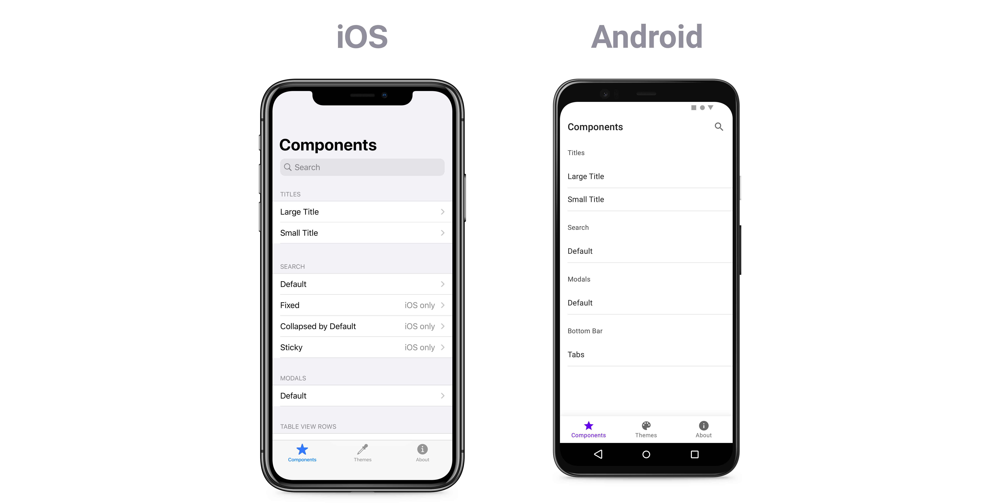

# Bedrock
Bedrock is a React Native starter kit for creating apps that adhere to iOS and Android design guidelines.

# Intro
iOS and Android come with sophisticated native components which are underutilized by product development teams using React Native. Bedrock enables teams to build UIs that are familiar to their users.

## Who is this for?
- The team is building an MVP, or
- The product would benefit from a native look and feel.

## FAQ
- **How does this differ from other starter kits?** Using this starter kit is the fastest way to build a good user experience. Apps that utilize native components enjoy better engagement metrics.
- **What's the status of this project?** Bedrock is pre-Alpha and in active development.

# Further Help?
This repo is a great place to start, but if you'd prefer to sit back and have your new project built for you, [get in touch with us directly](https://foundationlabs.io) and we can organize a quote.
